# Taylor Insurance React Frontend

A Mock React Frontend for the website of the hypothetical insurance company Taylor Insurance. 

Built with Next.JS and Tailwind CSS in VSCode

Connects with the following backend's API to perform CRUD operations relating the users, insuarble entities (home & auto), quotes, policies, etc.

**Backend**: https://github.com/UnusualFrog/Taylor_Insurance_Spring_Backend/


## Setup

Once the repo is cloned, run the following to install all neccesary packages:

```
  npm i
```

Then build and run the app with:

```
 npm run build
 npm run start
```

or run in debug mode with:

```
 npm run dev
```


## Usage/Examples

The website features an account system. Users will need to first register before a password is created. Passwords are automatically hashed with SHA-256 encryption. Once a customer account is created, the customer may log in and view their account details.

From the account page customers can view and manage their personal information and update their password. Customers can add home or auto entities to their account from the accounts page. Once an entity is added


## Screenshots

### Main Area

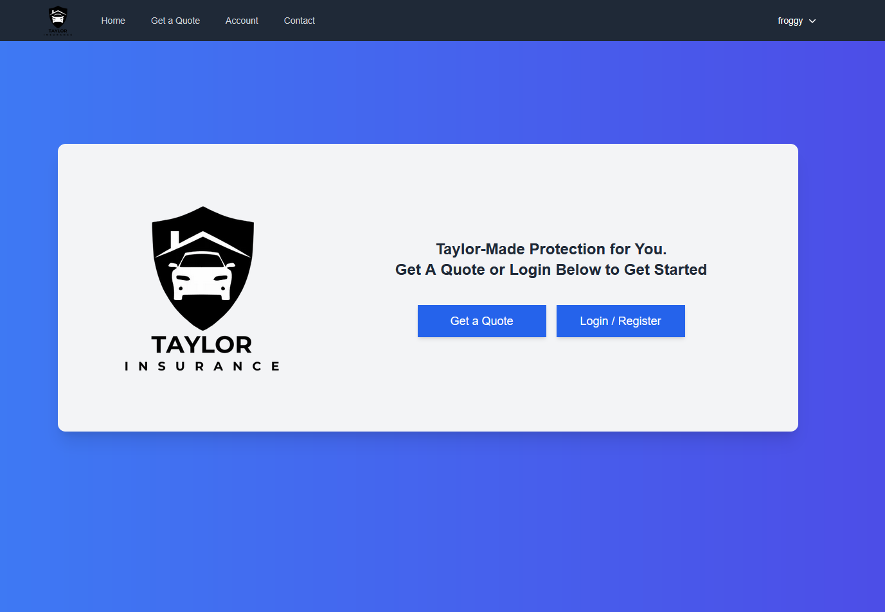

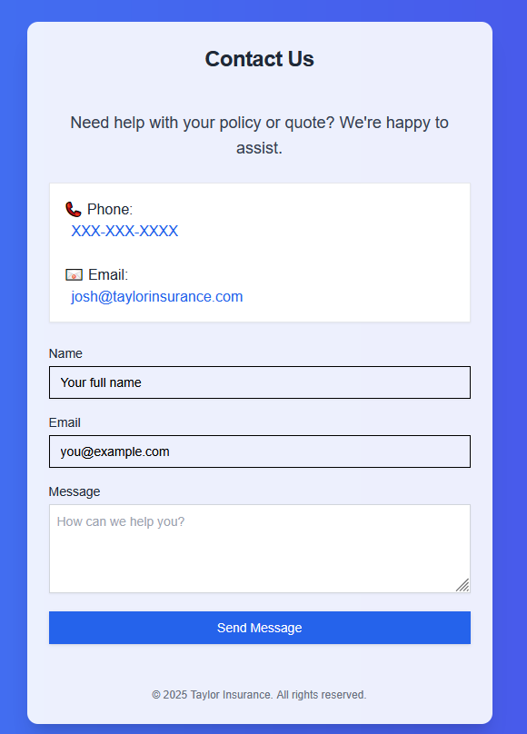

### Account Area

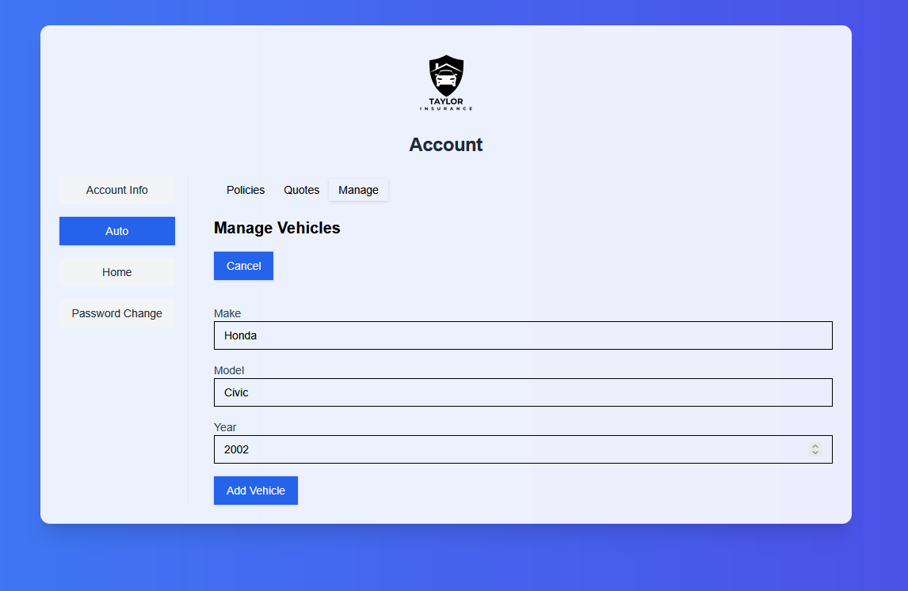

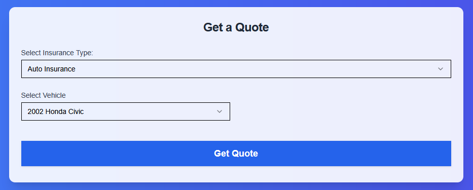

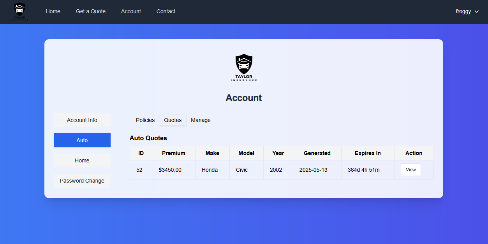


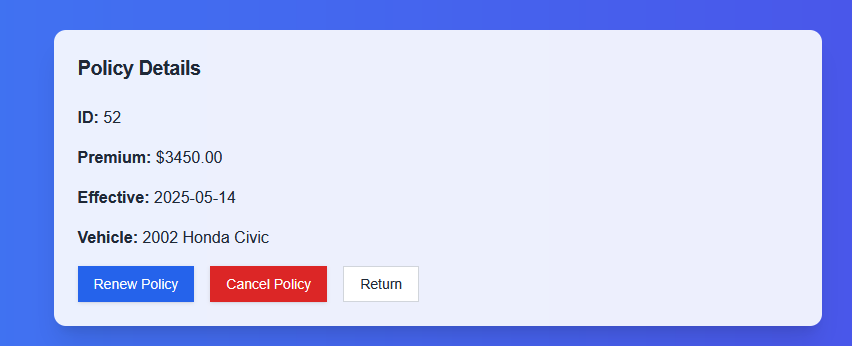

### Employee Area

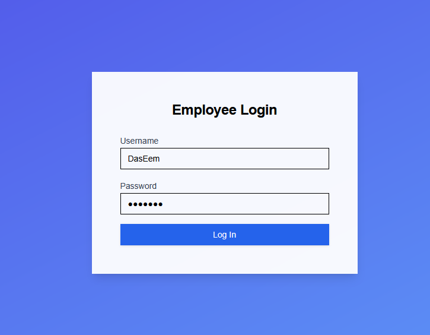

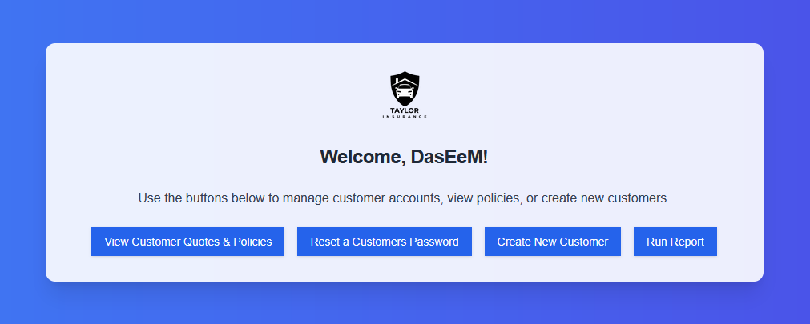

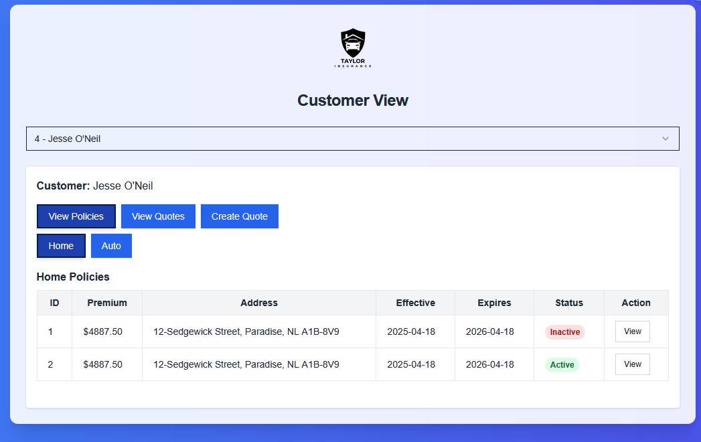

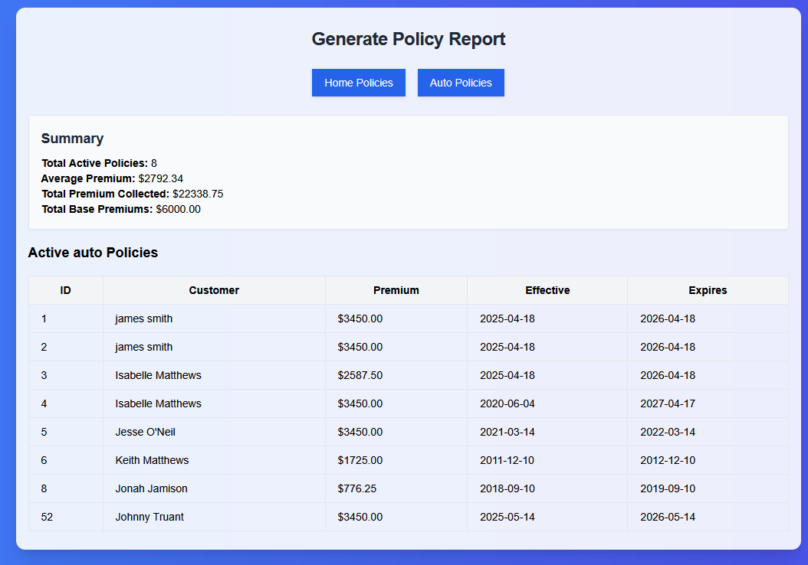

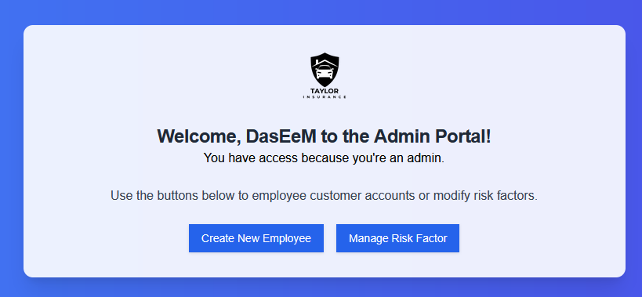

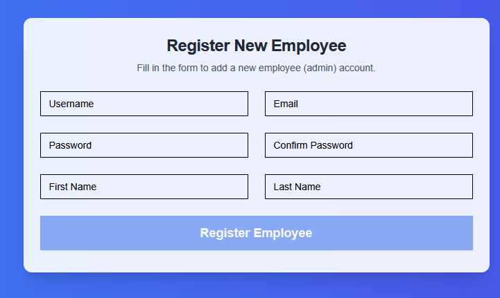

